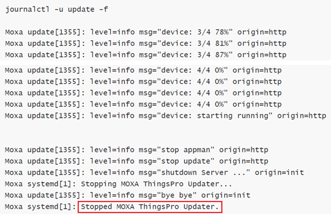

Connecting modbus devices to azure iot hub

# Install ThingsPro Edge v2.0.0

## Default credential and IP address
  - username/password:  moxa/moxa
  - IP LAN1 192.168.3.127 
  - IP LAN2 192.168.4.127

## Set to Default

Reset to factory default

If the unit has been installed prior, we should reset it back to default before installing ThingsPro Edge. The commands listed below is for `armhf` and UC-8100A series gateway

```sh
mx-set-def
```

> Note: Make sure to have a console cable conected to the device or login via ssh

Remove docker folder
```sh
rm -rf /overlayfs/docker /overlayfs/working/docker
```

> Note: This will wipe out all the data on the device!

## Configure Network
```sh
dhclient eth0
```
> Note: Make sure there is a dhcp server on LAN1

## Download and Install ThingsPro with Internet 
- armhf:
    ```sh
    wget https://thingspro.blob.core.windows.net/software/edge/V2.0.0/update_2.0.0-1424-uc-8112a-me-iotedge_armhf.deb
    dpkg -i ./update_2.0.0-1424-uc-8112a-me-iotedge_armhf.deb
    ```
## Download and Install ThingsPro without Internet
Click on the url below which start downloading thingspro software, it takes 5~10 minutes depending the network speed of your internet connection. 

After the download is completed, copy .deb package file on the UC gateway via FTP

> Hint: On Windows10 use WinSCP tool. It is free tool available on the url below. 
 ```sh
https://winscp.net/eng/download.php
 ```
 - armhf:
     ```sh
     dpkg -i ./update_2.0.0-1424-uc-8112a-me-iotedge_armhf.deb
     ```

## Update the Installation Process
```sh
journalctl -u update -f
```

## Track Installation Progress
   

> Note: The entire process will take about ~11 minutes depends on the hardware/model. When it shows "Stopped MOXA ThingsPro Updater", you can reboot the device by command listed below

## Reboot Device
```sh
sudo reboot
```


