# Connecting ModbusTCP slave devices to azure iot hub using Moxa UC-8112A IIoT Gateway running Microsoft Modbus Container (Azure IoT Edge + ThingsPro Edge)

## This document lists the following steps:
   - Install ThingsPro Edge v2.0.0
   - Deploy Modules from Azure Portal
   - Verify Modules on UC-8112A IIoT Gateway
   - Setup Modbus Slave Simulator
   - Monitor ModbusTCP Sensor D2C Telemetry data to Azure IoT Hub

# Install ThingsPro Edge v2.0.0

## Default credential and IP address
  - username/password:  moxa/moxa
  - IP LAN1 192.168.3.127 
  - IP LAN2 192.168.4.127

## Set to Default

Reset to factory default

If the unit has been installed prior, we should reset it back to default before installing ThingsPro Edge. The commands listed below is for `armhf` and UC-8100A series gateway

```sh
mx-set-def
```

> Note: Make sure to have a console cable conected to the device or login via ssh

Remove docker folder
```sh
rm -rf /overlayfs/docker /overlayfs/working/docker
```

> Note: This will wipe out all the data on the device!

## Configure Network
```sh
dhclient eth0
```
> Note: Make sure there is a dhcp server on LAN1

## Download and Install ThingsPro on UC-8112A with Internet 
- armhf:
    ```sh
    wget https://thingspro.blob.core.windows.net/software/edge/V2.0.0/update_2.0.0-1511-uc-8112a-me-iotedge_armhf.deb
    dpkg -i ./update_2.0.0-1511-uc-8112a-me-iotedge_armhf.deb
    ```
## Download and Install ThingsPro on UC-8112A without Internet
Click on the url below or copy url it on your web browser which starts downloading thingspro software, it takes 10~12 minutes depending the network speed of your internet connection. 
 ```sh
https://thingspro.blob.core.windows.net/software/edge/V2.0.0/update_2.0.0-1511-uc-8112a-me-iotedge_armhf.deb
 ```
 

After the download is completed, copy .deb package file on the UC gateway via FTP

> Hint: On Windows10 use WinSCP tool. It is free tool available on the url below. 
 ```sh
https://winscp.net/eng/download.php
 ```
 - armhf:
     ```sh
     dpkg -i ./update_2.0.0-1511-uc-8112a-me-iotedge_armhf.deb
     ```

## Update the Installation Process
```sh
journalctl -u update -f
```

## Track Installation Progress
   

> Note: The entire process will take about ~11 minutes depends on the hardware/model. When it shows "Stopped MOXA ThingsPro Updater", you can reboot the device by command listed below. The SSH service will be disabled after TPE is installed. 

## Reboot Device
```sh
sudo reboot
```

# Deploy Modules from Azure Portal

## thingspro-agent
- Select your iotedge device from the list
 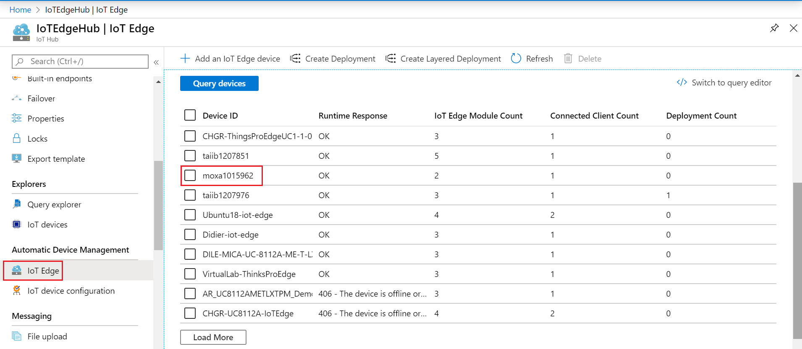

- Set Modules
 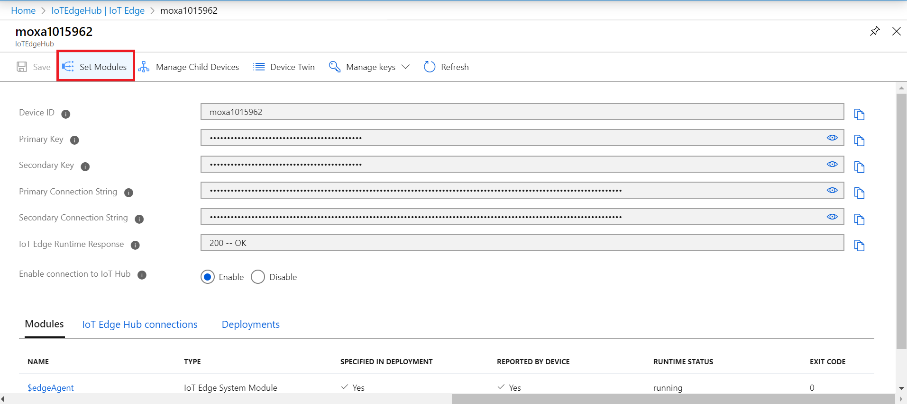
 
 - IoT Edge Module
 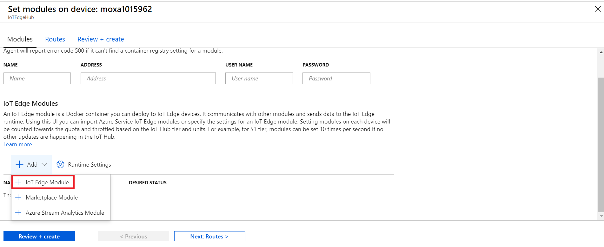
 
 - IoT Edge Module Name & Image URI
   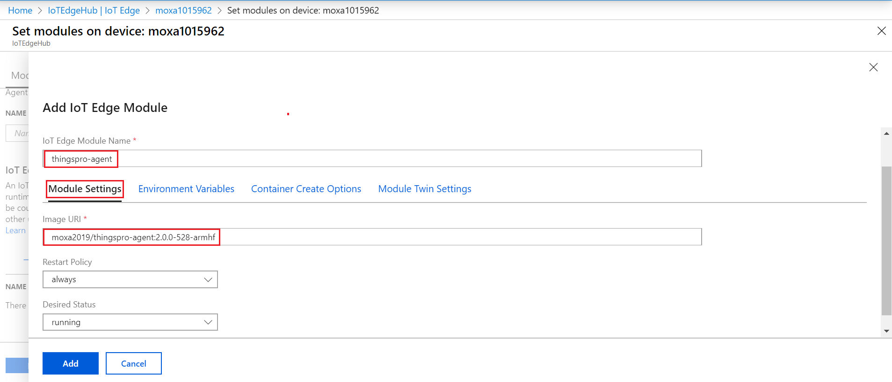
   - Image URI:
       - armhf:
            ```
            moxa2019/thingspro-agent:2.0.0-528-armhf 
            ```
- Container Create Options 
   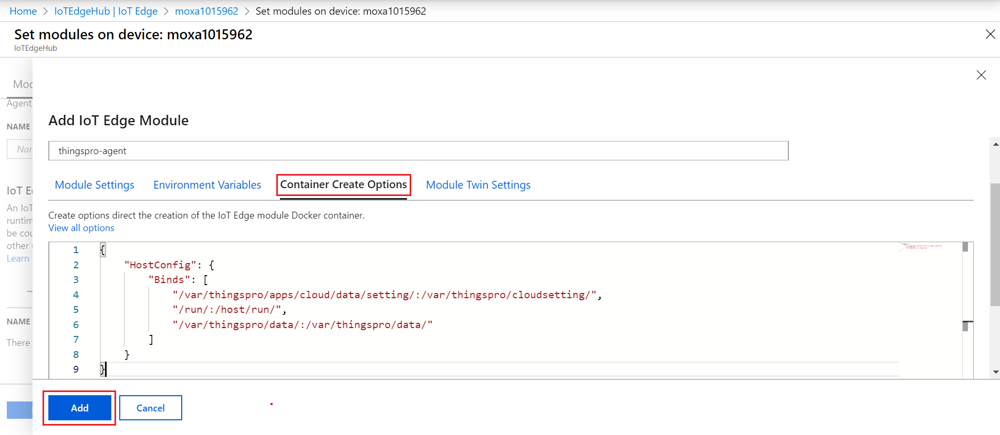
    - Container Create Options:
    ```
    {
         "HostConfig": {
             "Binds": [
                 "/var/thingspro/apps/cloud/data/setting/:/var/thingspro/cloudsetting/",
                 "/run/:/host/run/",
                 "/var/thingspro/data/:/var/thingspro/data/"
              ]
          }
    }
    ```
## Modbus

- IoT Edge Module Name & Image URI
   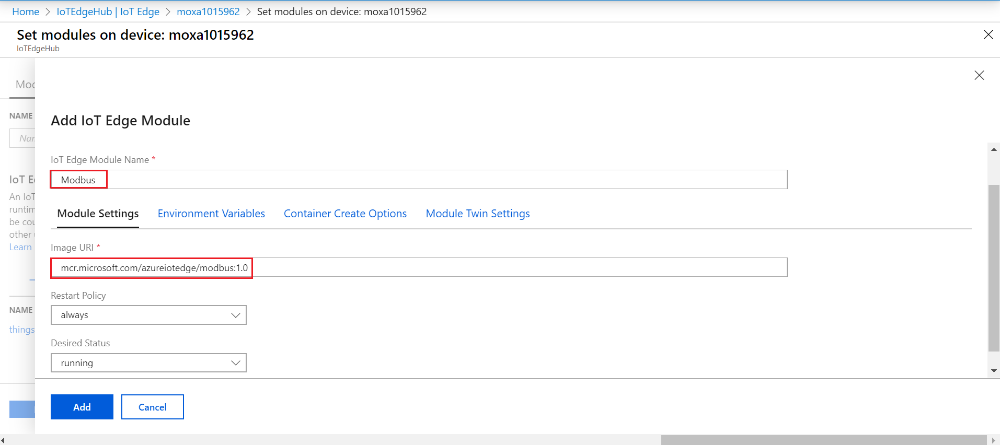
   - Image URI:
              ```
              mcr.microsoft.com/azureiotedge/modbus:1.0 
              ```
            
- Module Twin Settings
   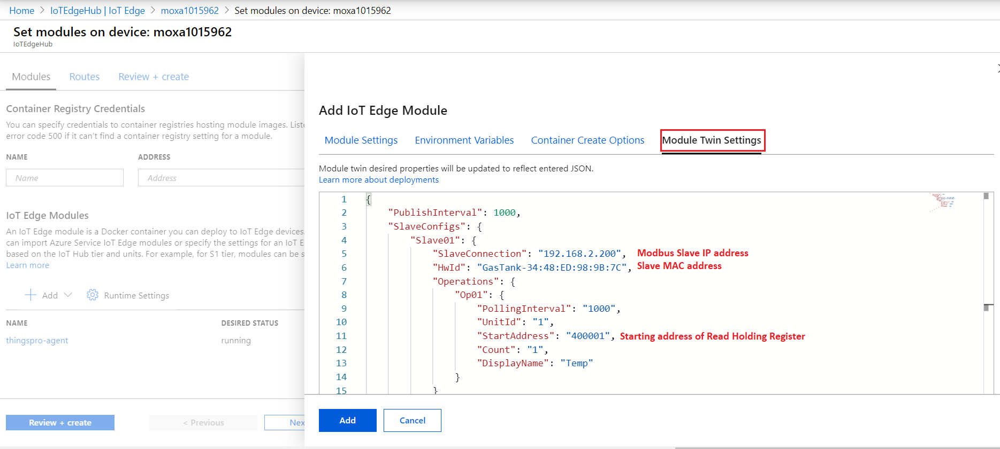
    - Module Twin Settings:
    ```
    {
          "PublishInterval": 1000,
          "SlaveConfigs": {
              "Slave01": {
                  "SlaveConnection": "192.168.2.200",
                   "HwId": "GasTank-34:48:ED:98:9B:7C",
                   "Operations": {
                       "Op01": {
                           "PollingInterval": "1000",
                           "UnitId": "1",
                           "StartAddress": "400001",
                           "Count": "1",
                           "DisplayName": "Temp"
                       }
                  }
             }
        }
   }
   ```

- Routes
    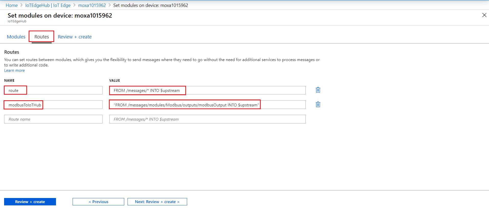
    - NAME:
        ```
        route
        ```
    - VALUE:
        ```
        "FROM /messages/* INTO $upstream"
        ```
        
   - NAME:
        ```
        modbusToIoTHub
        ```
    - VALUE:
        ```
        "FROM /messages/modules/Modbus/outputs/modbusOutput INTO $upstream"
        ```
        
- Review + create
   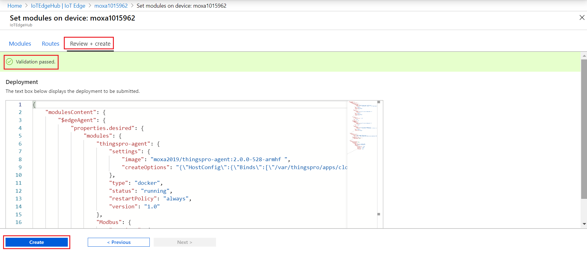
  
 ## Modules Runtime Status
   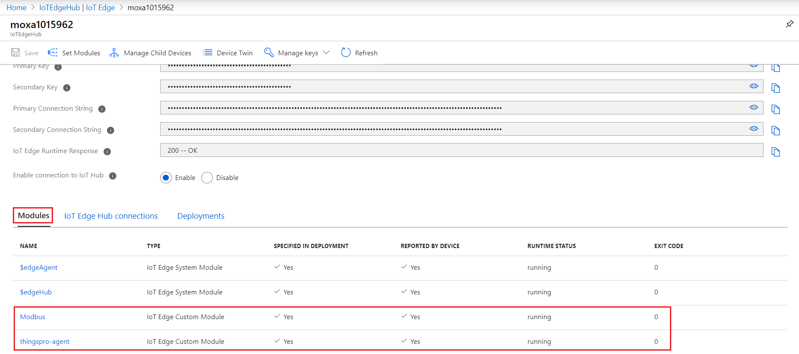
   
 > Note: After successfull deployment the iotedge device pull the module images specified in the deployment manifest and start the conatiner from the image. This takes 4~5 minutes depending on the network speed. The iot edge device sends the status updates via reported properties to azure iot hub.  
    
# Verify Modules on UC-8112A IIoT Gateway

## Connect the gateway via Local Web GUI 

Default credentials 
  - username/password:  admin/admin@123

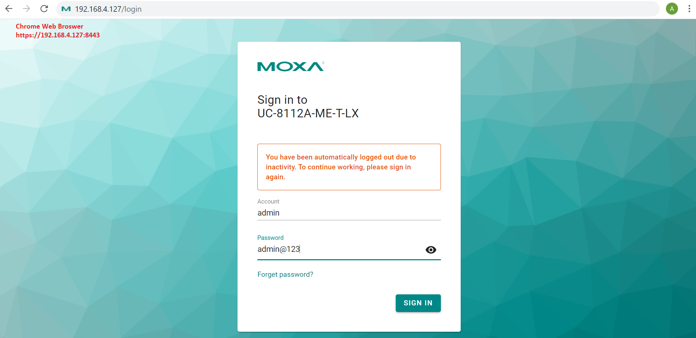

## Azure IoT Edge
  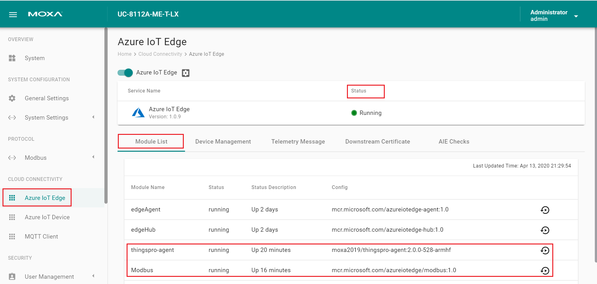
  
# Setup Modbus Slave Simulator

## Download and Install Modbus slave simulator 64bit for Win10
```sh
https://www.modbustools.com/modbus_slave.html
```
>Note: There is a 10 minutes from connection limit. After 10 minutes the connection is disconnected. Re-starting the application will initiate another 10-minutes demonstration period. After 30 days it is not possible to make a connection. The license key is valid for both versions.

## Modbus Slave Setup
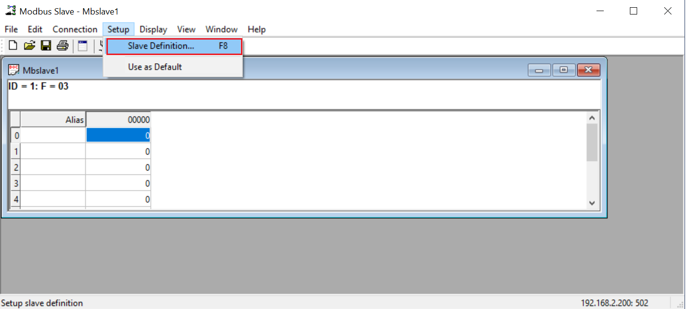

## Modbus Slave Definition
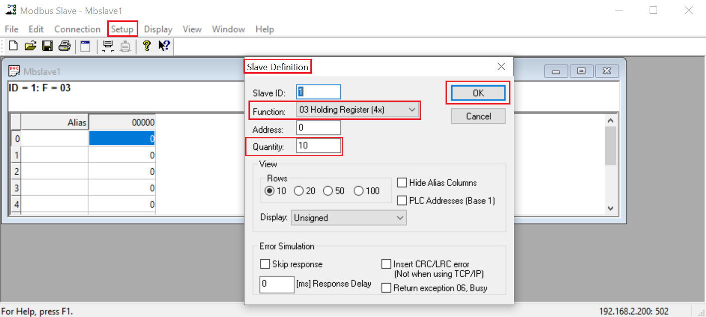

## Define ModbusTCP Simulated THP Sensor Data
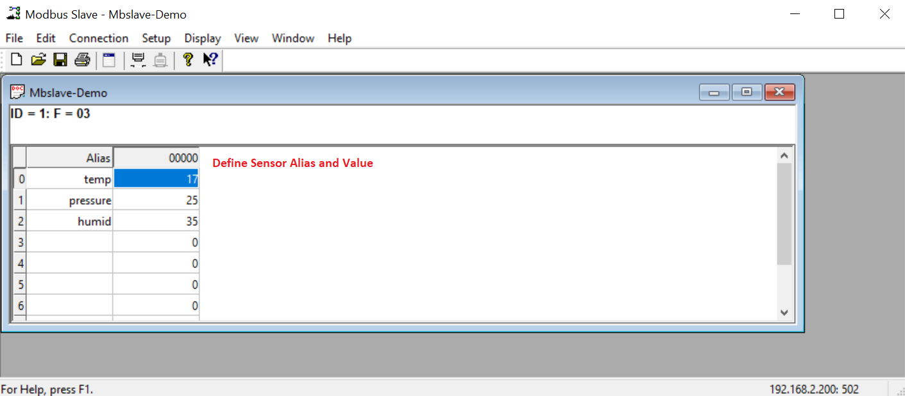

## Connection Setup 
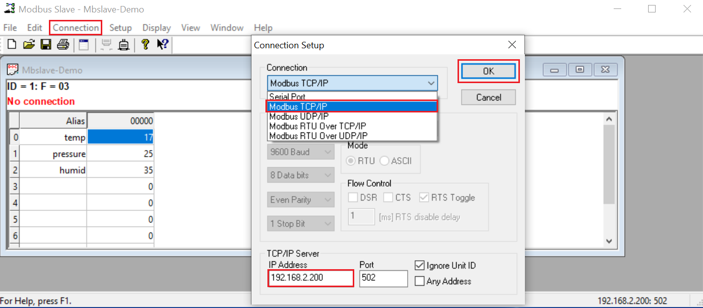

>Note: TCP/IP Server is the IP address of the Ethernet Interface of your notebook. Make sure the notebook IP address is on the same local network. In my case notebook IP address is 192.168.2.200 and UC-8112A LAN2 IP address is 192.168.2.127

## Established Connection to the Gateway

> Note: Press Ok, On successfull connection to the IIoT gateway you'll see the following output

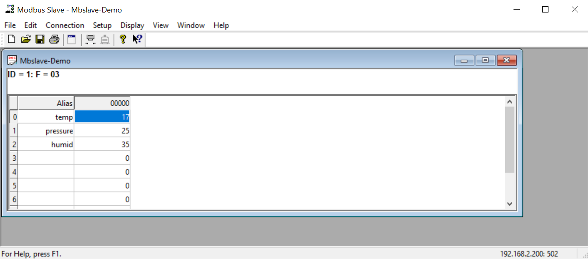

# Monitor ModbusTCP Sensor D2C Telemetry data to Azure IoT Hub

## Download and Install Azure IoT Explorer (.MSI)
```sh
https://github.com/Azure/azure-iot-explorer/releases
```
## Use Azure IoT Explorer to Monitor D2C telemetry data
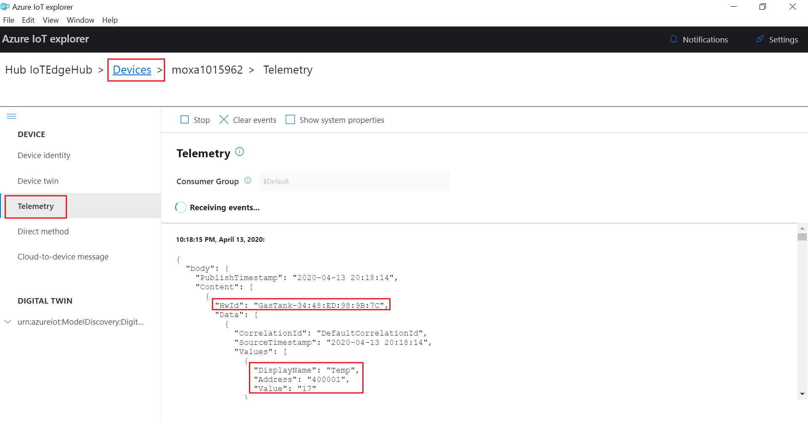

## Modify ModbusTCP Slave Temp Sensor 
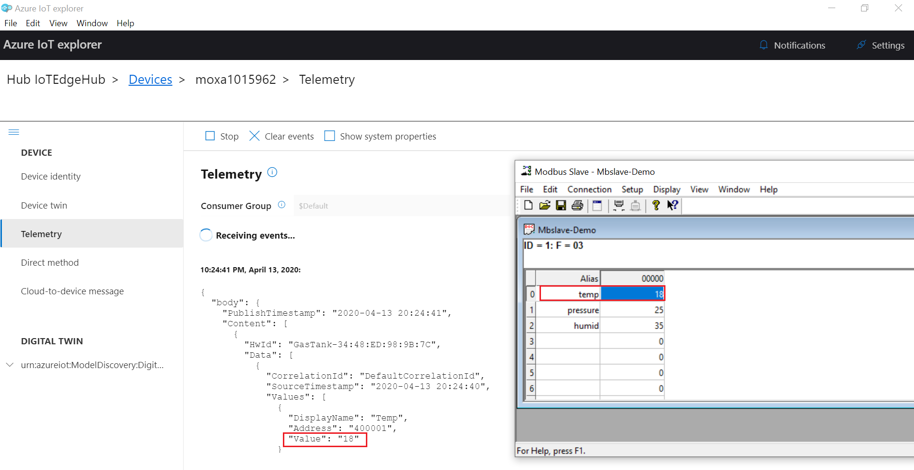

